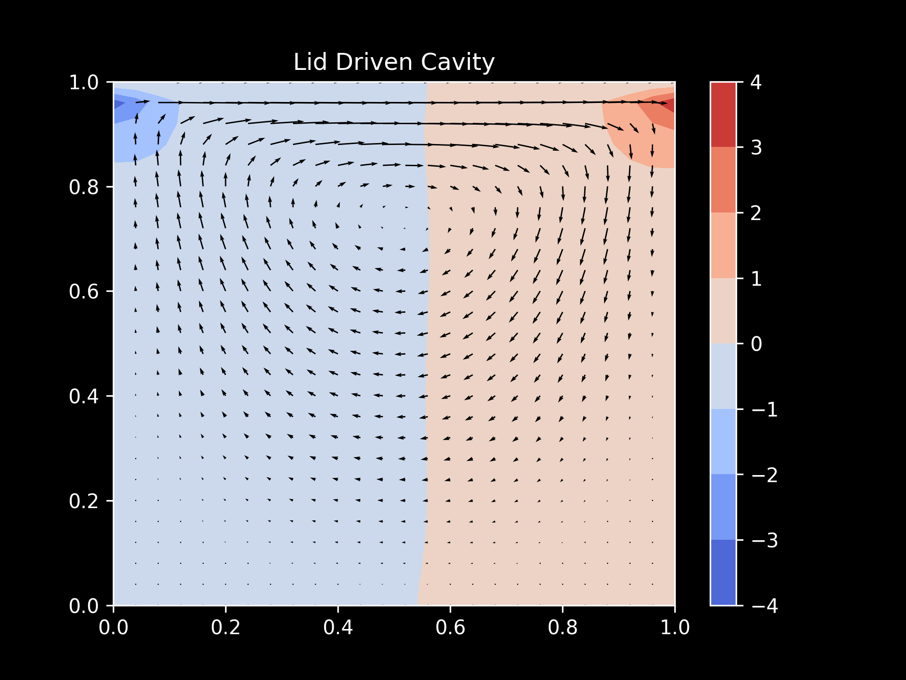

# 2D Lid-Driven Cavity Flow Simulation

This project simulates the 2D lid-driven cavity flow using a finite difference method (FDM). The lid-driven cavity problem is a classic benchmark in computational fluid dynamics (CFD), where the fluid inside a cavity is driven by the motion of the top lid while the other walls remain stationary.

## Features

- Solves the **Navier-Stokes** equations for incompressible flow in 2D.
- Uses the **finite difference method (FDM)** to discretize the governing equations.
- Implements **pressure-velocity coupling** via the **Pressure Poisson equation**.
- Applies **central difference schemes** for spatial derivatives and **explicit time stepping**.
- Includes **homogeneous Dirichlet boundary conditions** for velocity and **Neumann boundary conditions** for pressure, except for a Dirichlet condition at the top wall.

## Files

- `main.py`: The main Python script that runs the lid-driven cavity simulation.
- `lid_driven_cavity.png`: Visualization of the pressure contour and velocity field for the flow.

## Requirements

The project uses the following Python libraries:

- `numpy`
- `matplotlib`
- `tqdm`

You can install the required libraries by running:

```bash
pip install numpy matplotlib tqdm
```
## Result


